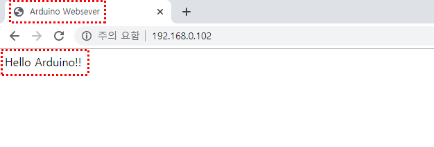

### Ethernet 연결


인터넷 케이블을 직접 연결하여 사용하는 이더넷 모듈(ENC28J60)입니다. 

모듈 형태에서 볼 수 있듯이 랜선(LAN)을 모듈의 케이블 커넥터에 바로 연결할 수 있고 아두이노가 인터넷 통신을 할 수 있게 합니다.

 'ENC28J60' 칩셋을 사용해서 모델명이 보통 ENC28J60 이더넷 모듈


#### 이더넷(Ethernet) 모듈 배선

이더넷 모듈은 구동 전압이 3.1~3.4V로 VCC 핀을 아두이노의 3.3 V 핀에 연결해주고, GND는 아두이노 GND와 연결합니다. 

이더넷 모듈은 아두이노와 통신을 시리얼 통신(Serial communication) 중 하나인 SPI (Serial Peripheral Interface: 직렬 주변기기 인터페이스) 통신을 사용하고 있습니다. 랜선(LAN)을 통해서 송수신하는 신호를 아두이노에 MOSI, MISO, SCK, SS선을 통해 전달하는데, 각각의 역할은 표와 같습니다.

* MOSI(SI):  Slave In  마스터(아두이노)에서 데이터를 출력하기 위한 신호
* MISO(SO): Slave Out  슬레이브(이더넷 모듈)에서 데이터를 출력하기 위한 신호
* SCK: Serial Clock  Clock (동기화) 신호
* SS(CS): Slave Select 데이터를 송수신할 슬레이브(이더뎃 모듈)를 선택하기 위한 신호

SPI 통신에 대해선 다음에 시리얼 통신에 대해 다루면서 자세히 알아보도록 하겠습니다. 

다시 이더넷 모듈로 돌아가서 전원을 위한 VCC와 GND pin 외에 6개 핀 중에서 SI, SO, SCK, CS만 사용합니다. 

SI는 11번 핀, SO는 12번 핀, SCK는 13번 핀에 연결하고 CS는 8번 핀에 연결하면 되는데 나중에 프로그램에서 자유롭게 바꿀 수 있습니다.


#### 코딩

DHCP(Dynamic Host Configuration Protocol: 동적 호스트 구성 프로토콜)와 DNS(Domain Name System)를 테스트하여 IP주소를 할당받을 수 있는 프로그램입니다. 

``` c
#include <EtherCard.h>
#define REQUEST_RATE 5000 // milliseconds

// ethernet interface mac address
static byte mymac[] = { 0x74,0x69,0x69,0x2D,0x30,0x31 };

byte Ethernet::buffer[700];

void setup () {
  Serial.begin(57600);
  Serial.println("\n[getDHCPandDNS]");

  // Change 'SS' to your Slave Select pin, if you arn't using the default pin
  if (ether.begin(sizeof Ethernet::buffer, mymac, SS) == 0)
    Serial.println( "Failed to access Ethernet controller");

  if (!ether.dhcpSetup())
    Serial.println("DHCP failed");

  ether.printIp("My IP: ", ether.myip);
  ether.printIp("Netmask: ", ether.netmask);
  ether.printIp("GW IP: ", ether.gwip);
  ether.printIp("DNS IP: ", ether.dnsip);
}

void loop () {
}
```


### 아두이노 웹서버

 'ENC28J60' 이더넷 모듈을 아두이노 UNO R3 보드와 연결하여 DHCP(Dynamic Host Configuration Protocol: 동적 호스트 구성 프로토콜)를 통해 IP 할당받았습니다. 그럼 오늘은 진짜 인터넷 되는지 궁금하니까 할당받은 IP를 통해 웹 브라우저(web browser)에 간단한 텍스트를 띄워보도록 하겠습니다


#### 코드

```c
#include <EtherCard.h>
// ethernet interface mac address, must be unique on the LAN
static byte mymac[] = { 0x74,0x69,0x69,0x2D,0x30,0x31 };

byte Ethernet::buffer[700];

const char webpage[] PROGMEM =
"<html>"
  "<head>"
  "<title>"
    "Arduino Websever"
  "</title>"
  "</head>"
  "<body>"
    "Hello Arduino!!"
  "</body>"
"</html>"
;

void setup () {
  Serial.begin(57600);
  Serial.println(F("\n[webClient]"));

  // Change 'SS' to your Slave Select pin, if you arn't using the default pin
  if (ether.begin(sizeof Ethernet::buffer, mymac, 8) == 0)
    Serial.println(F("Failed to access Ethernet controller"));
  if (!ether.dhcpSetup())
    Serial.println(F("DHCP failed"));

  ether.printIp("IP:  ", ether.myip);
  ether.printIp("GW:  ", ether.gwip);
  ether.printIp("DNS: ", ether.dnsip);
}
void loop () {
  ether.packetLoop(ether.packetReceive());
  memcpy(ether.tcpOffset(), webpage, sizeof webpage);
  ether.httpServerReply(sizeof webpage);
  }
```


