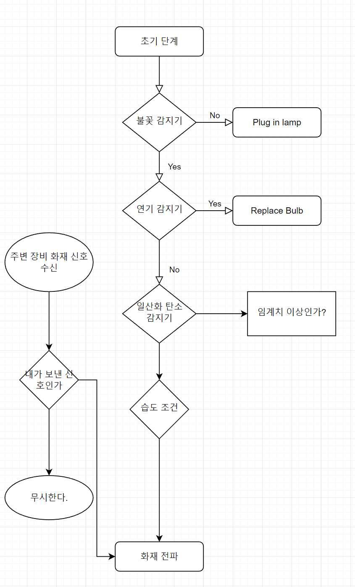

## 해결하려고 하는 환경 사회 문제


#### 1. 인류 멸망의 문제 : 온실효과

https://www.youtube.com/embed/sMjAroVIp0k


#### 2. IPCC 보고서 : 이산화탄소

https://www.hankyung.com/economy/article/202108260111i

IPCC 제6차 보고서, 10년 당겨진 위기 시계


이번 제6차 보고서가 더 충격적인 점은, 3년 전에 발표한 특별 보고서보다 지구가 더 빨리 뜨거워졌기 때문이다. 특별 보고서는 1.5℃ 기온 상승 도달 시점을 2052년 무렵으로 예측했는데, 이번 보고서는 10년 이상 빠른 2040년에 도달할 것으로 예측하고 있다. 이는 전례없는 일로 2011년부터 지난해까지 전 지구의 평균기온이 산업화 이전보다 1.09℃ 높아졌고, 해수면 상승 속도도 약 2.85배 증가하는 등 최근 추세가 매우 심각함을 보여준다.

주목할 점은, 2019년 대기 중 이산화탄소 농도가 200만 년 만에 최대값을 기록했다는 것이다. 보고서는 1850년 이후 인간은 2조4000억 톤의 이산화탄소를 배출했는데, 기온 상승을 1.5℃ 이내로 억제하기 위한 이산화탄소 배출 허용량은 이제 4000억 톤밖에 남지 않았다고 지적했다. 이는 지구의 온도 변화를 억제할 수 있는 **이산화탄소의 86%를 이미 배출했다**는 의미다. 최근에는 기온 상승 추세가 더욱 빨라져 10년마다 0.2℃씩 오르고 있다. 현재 속도로 이산화탄소를 배출한다면 기온 상승의 마지노선인 1.5℃를 초과하는 것은 시간문제라고 보고 있다.


#### 3. 산불과 이산화탄소: 전 세계 산불로 인한 이산화탄소 배출량 8월 또 최고 기록

https://www.hani.co.kr/arti/science/science_general/1012318.html


유럽연합의 코페르니쿠스대기감시소(CAMS)는 “8월 한달 동안 산불로 1.3기가톤의 이산화탄소가 배출됐다. 인공위성 자료는 기후변화 때문에 세계적으로 얼마나 광범위한 지역이 일촉즉발의 위기 상황인지를 보여준다”고 밝혔다. 8월 배출량은 코페르니쿠스대기감시소가 2003년 관측을 시작한 이래 가장 높은 양이다.

##### 우리나라의 강원도 산불 문제로 좁히지 말자!!!

##### 산불 문제는 Global 위기의 문제로 보자!!


8월 배출량의 대부분은 북미와 시베리아에서 방출됐다. [가장 큰 숲을 보유한 러시아는 시베리아 타이가숲에서 6~8월에 970메가톤의 이산화탄소를 대기중에 내뿜었다.](https://www.hani.co.kr/arti/international/asiapacific/1007270.html) 나머지 세계 산불에서 발생한 이산화탄소를 합친 양보다 많다.


#### 4. 산불과 이산화 탄소 배출량 연구

##### 산불발생에 따른 이산화탄소 배출량 예측에 관한 연구

A Study on Prediction of Carbon Dioxide Causing by Forest Fire


[
기후변화협약에 의한 제2차 대한민국 국가보고서](https://www.motie.go.kr/common/download.do?fid=bbs&bbs_cd_n=72&bbs_seq_n=1278&file_seq_n=1)


https://www.forest.go.kr/kfsweb/kfi/kfs/frfr/selectFrfrStats.do?mn=NKFS_02_02_01_05


#### 5. 유엔기후변화 협약에 따른 4차 대한민국 격년 갱신보고서


## 문제 해결을 위해서 제안하는 소프트웨어

#### 현재 문제점

1. 넓은 지역 감시
2. 24시간  감시
3. 사람이 커버하지 못하는 지역의 감시 (오지/우리 나라 말고...)
4. 발생 초기에 즉시 감시


#### 입장을 바꿔서 진짜 문제는?

1. 지역 주민
2. 산림청
3. 개발자 입장
4. 산림 감시자 (퇴근)
5. 비용이 많이 들어서 해결하지 못하는 상황인가?
6. 기술적으로 연구 개발이 더 필요한 상황인가?
7. 알수가 없는 것인가?
8. 판단 할수 가 없는 것인가?
9. 알아도 어떻게 할 수 가 없는 문제 인가?
10. 내가 해결할 문제인가?


#### 그래서 문제를 한문장으로 정리해보면... (해결 하려는 문제가 정리가 잘되어야 함)


### 진짜 문제는 무엇인가?


#### 왜 문제 인지 생각 해봅시다.

정의한 문제에 대한 해결책을 정하기 전에 '왜'라는 질문을 반복해보는 것이다. 이를 통해 성급하게 결론을 내리거나 빈약한 해결책을 내놓는 것을 방지할 수 있다.


#### 문제가 정의 되었으면  대한 근본적인 질문을 계속 해보자.

```
Process
(1) Domain : 문제, 관심사 또는 이슈를 관찰하라. 그리고 문제 기술서를 작성하라.
(2) Session :
- 문제 기술서를 활용해서 '왜~'라고 질문하라 (Why 1)
- 그 질문에 대답하고 다시 그 대답에 대한 이유를 질문하라 (Why 2)
- Why 3, 4, 5... 더 이상 필요가 없을때까지 되풀이한다. 
- 필요에 따라 여러번 잠재적 근본원인을 알기 위해 전체 프로세스를 여러번 반복하라 (근본적 원인은 본인이 통제할 수 있는 것이어야 한다)
(3) Record : 제시된 답변을 문서화한다
(4) Analysis : 수집된 정보를 통해 주제 및 패턴을 찾아라. 이러한 정보는 리서치 질문 개발을 이끌어 낼 수 있다.
```


##### 예시

```
[Example 1]
(1) 문제를 관찰하라 : 나는 일할때 행복하지 않다.
(2) 문제 기술서를 만들어라 : 나는 내 일을 좋아하지 않는다.
- 5Why로 질문하라
- Why 1 : 나는 일할때 즐겁지 않다 
- Why 2 : 나는 내 일을 선택할 수 없었다  
- Why 3 : 나는 승진을 못했다 
- Why 4 : 나는 고용주를 위한 가치를 충분히 만들지 못했다
- Why 5 : 나는 윗사람에 맞추는 기술이 없다
(3) 가능 솔루션 
- 이상적인 직업을 가진 사람과 인터뷰하고 그들이 가진 스킬이 무엇이고 어떻게 직업을 가지게 되었는지 질문하라
```


```
[Example 2] 
한 때 미국의 워싱턴 주에 있는 제퍼슨 기념관은 돌로 된 기념관의 벽이 심하게 부식되고 있어서 유지보수작업이 불가피하게 된 적이 있었습니다. 방문객들은 기념관에 대한 관리가 부실하여 훼손된 것이라며 불만을 터트렸고 기념관의 이미지는 악화되었습니다. 또한 보수작업 요원들은 청결 유지에 너무 많은 시간을 소모하고 있었고 그만큼 비용도 증가하고 있는 실정이었지요. 제퍼슨 기념관은 이 문제를 '5WHY'를 통해 해결합니다. 어떻게 해결했을까요?

(1) 문제 기술 (현재상태의 구체적 기술) : 기념관의 대리석 벽이 심하게 부식되고 있다.
- Why 1 : 왜 기념관의 대리석이 부식되고 있는가? : 대리석을 비눗물로 너무 자주 닦기 때문이다. 
- Why 2 : 왜 비눗물로 바닥을 자주 닦는가? : 비둘기가 많아 비둘기의 배설물들이 많이 떨어지기 때문이다.
- Why 3 : 왜 비둘기들이 많은가? : 기념관에 비둘기가 좋아하는 거미들이 많기 때문이다.
- Why 4 : 왜 거미들이 많은가? : 해지기 전에 전등을 켜서 거미들의 먹이인 나방이 많기 때문이다.
- Why 5 : 왜 해지기 전에 전등을 켜는가? : 기념관 직원들이 퇴근을 일찍 하기 때문이다.
(2) 해결책 : 직원들을 2시간 정도 늦게 퇴근하게 하라
```


```
다섯개의 질문은 체중 감소를 둘러싼 그들의 태도와 행동을 이해하기 위해 미국 전역의 다이어트하는 여성과 인터뷰때 사용되었다.
- Why 1 : 왜 당신은 운동하는가? : 건강 때문이다. 
- Why 2 : 왜 건강인가? : 심박수를 높이기 때문이다.
- Why 3 : 왜 그것이 중요한가? : 그러면 많은 칼로리를 소모한다
- Why 4 : 왜 그것을 하고 싶어하는가? : 체중을 줄이기 위함이다.
- Why 5 : 왜 체중을 줄이고 싶은가? : 건강해 보이도록 사회적 압력을 느낀다.
```


그래서 해결 하려고 하는 Software가 무엇인지 한문장으로 정리를 해보자.

그리고 그것이 근본적인 문제를 해결 할 수 있는 것인가?

기술적 문제인지? 제도적 문제인지?


## 제안하는 소프트웨어 구조와 설계

1. 산불 정보 수집
2. 분석 (판단)
3. 전달(알림) (산불이라고 판단한 근거 자료: 온도, 불꽃, 위치, 일산화탄소 농도 증가) 
4. 정상 상태를 알림 (이때는 )


#### 설계 단계에서 하는일

1. 기능 정의 : 기능 목록 정의, 요구하는 기능이 빠짐없이 설계에 반영
2. SW 신뢰성 확보 방법 : 오동작, 보안, 침해로 부터 보호, 올바른 정보를 전달
3. 사용성 : 어떻게 사용을 편리하게
4. 효율성: 비용대비 효율적 운영 , 너무 비싸면 안된다. 수작업이 많으면 안된다.
5. 이식성
6. 가용성: 시스템이 죽으면 안된다.


### 감지, 수집 단계

#### 1. 불꽃 감지기 :  


* 제약사항: 최대 감지 거리 짧다

* 근거리 열복사 적외선

* 불 꽃으로 감지하다 보면 감지기 본체가 손상되는 경우는 어떻게 하지?

  

#### 2. 열화상 감지기

https://www.hancommds.com/supplytype


https://ko.aliexpress.com/i/4001249812182.html

Gy-amg8833 IR 8x8 적외선 어레이 열 화상 카메라 센서 모듈 전원 공급 장치: 3-5v AMG8833 적외선 열 화상 카메라 센서는 8x8 적외선 열 센서 어레이입니다. 마이크로 컨트롤러 (또는 라즈베리 파이) 에 연결하면 I2C 를 통해 64 개의 개별 적외선 온도 판독 값 세트가 반환됩니다. 멋진 카메라와 비슷하지만 쉽게 통합할 수 있도록 작고 간단합니다. AMG8833 은 panasonic의 차세대 8x8 열 적외선 센서이며 이전 amg8831 보다 높은 성능을 제공합니다. 센서는 I2C 만 지원하고 설정 가능한 인터럽트 핀이 있으며, 단일 픽셀이 설정한 임계 값 위 또는 아래에있을 때 트리거할 수 있습니다. AMG8833 적외선 열 화상 카메라 센서의 온도 측정 범위는 0 °C ~ 80 °C (32 °F ~ 176 °F) 입니다. 정확도는-2.5 °C (4.5 °F) 입니다. 

그것은 최대 7 미터 (23) 피트의 거리에서 인간을 감지 할 수 있습니다. 

최대 프레임 속도는 10hz 이므로 자체 신체 탐지기 또는 미니 열 화상 카메라를 만드는 데 이상적입니다. 우리는 arduino에서이 획기적인 코드를 사용하거나 호환 (센서는 I2C 를 통해 통신) 또는 Raspberry pi를 사용하여 python을 사용합니다. Pi에서 SciPy python 라이브러리의 이미지 처리의 도움으로 8x8 그리드를 삽입하고 아주 좋은 결과를 얻을 수 있습니다!


* 제약사항: 최대 감지거리 7m 이것을 어떻게 극복할지?


#### 3. 연기 감지기


* => 화재로 발생하는 연기를 감지 할 수 있는 것인가?


#### 4. 일산화 탄소 검출 센서

* 산불에서 일산화 탄소 발생하는 가? (한다.)
* 일산화탄소는 **실내/실외 공기 중에 발견되는 자극성이 없고 무색 무취 무미의 기체**입니다. 탄소 연료가 불완전 연소될 때 발생하며, 인공적으로/자연적으로 생성됩니다. 가장 중요한 인공적인 발생원은 자동차 배기가스입니다.
* 모든 [유기체](https://ko.wikipedia.org/wiki/유기체)에 포함되어 있는 탄소를 태울 때 [불완전연소](https://ko.wikipedia.org/wiki/불완전연소)하면 일산화탄소가


##### 산불에서 발생하는 연기의 환경과 건강에의 영향

 NTIS 과제연계 보고서

○ 최근 지구의 기후변화가 산불이 발생하는 빈도를 증가시키고 있으며, 인간의 건강에도 큰 영향을 주고 있다.

* 불연기가 건강에 주는 부정적 영향에 대처하기 위해서는 산불의 구성요소와 건강영향을 제대로 이해하여야 할 것이다.  
* 산불은 주로 인간의 직·간접적인 활동에 의하여 발생한다. 2010년 유럽위원회는 유럽에서 발생하는 산불의 95%이상이 사람에 기인한다고 보고하고 있다. 
* 연기의 조성은 연소물질의 종류, 수분함량, 불의 온도와 산소, 바람 등 기후의 영향에 따라 달라질 수 있으며, 산불의 확산은 고온, 가뭄, 건조일수 등과 같은 환경요인에 영향을 받는다.  
* 연기는 수 천종 이상의 화합물로 구성되어 있으며, 기본적으로 이산화탄소와 수증기가 주성분이다. 
* 연기에 존재하는 다른 성분으로는 일산화탄소, 포름알데히드, 아크로레인, 다중방향성 탄화수소, 벤젠 그리고 입자상물질이 있다.  
* 산불이 인간의 건강에 해를 줌에도 불구하고 아직까지 산불의 건강영향이 소상하게 밝혀지지 않고 있다. 특히 산불에서 발생하는 미량가스와 에어로졸의 영향은 산불평가의 불확실성 때문에 아직 정량화되지 않고 있다.


#### 5. 위치 정보 감지 : GPS


#### 6. 배터리 모듈

##### 5V 1A 리튬폴리머 배터리 충전기 모듈

##### Micro USB 단자(TP4056 USB Lithium Battery Charger Module)

 

본 제품은 TP4056을 사용하는 리튬 폴리머 배터리 충전 모듈로, 웨어러블/포터블과 같은 휴대용 프로젝트의 충전지를 충전할 때 사용하는 배터리 충전 모듈이다. 충전을 하면서 제품의 사용이 가능하며 자체 보호회로가 내장 되어있다.


특징 (Features) : 충전하면서 사용가능, 3.7V 리튬 폴리머 배터리 전용, 마이크로 5핀 USB단자

사양 (Specification) 

입력 전압 : 5V

최대 충전 전류 : 1000mA

충전 제한 전압 : 4.2V ± 1%

배터리 과방전 보호 전압 : 2.5V

배터리 과전류 보호 : 3A

 

여기에 맞는 리튬 폴리머 배터리는 많이 나와있다. 실험용으로 구입한 [리튬폴리머 배터리 제품은 링크](https://mecha.kr/583884)를 참고한다. 배터리 용량이 커질 수록 가격도 비싸다. 


##### 배터리 사용 가능 용량 예측


배터리 수명 공식

배터리 수명 = 배터리 용량(mAh) / 부하 전류(mAh)


https://www.mouser.kr/technical-resources/conversion-calculators/battery-life-calculator


#### 7. 야외 설치 장비 주변 장비 신호 감지


#### 

### 판단(산불이라고 판단하는 단계/아니라고 판단하는 단계)

#### 1.  순서도로 정리 필요

https://app.diagrams.net/#G1fnzbCYy45dG2WEMxvUwkGhSfgfBYRhDN




#### 2. 정상/이상감지 단계의 메세지 전달

* 장비가 정상 일 때 보낼 메세지 (보내는 간격 : 10분/ 1분/1시간)
* 장비가 비정상 상태일 때 보낼 메세지 (즉시 발송)
* 메세지에 포함될 내용


#### 3. 현장 상황을  종합적으로 판단했을때 이것은 확실히 산불이 맞다.

* 메세지를 주변 장비에 전파 한다.
* 내가 보낸 메세지가 메아리 되어 돌아 온것은 무시한다. 
* 보내는 메세지에는 무엇을을 담을지?


### 정보 전달 방법

1. PAN
2. LAN
3. WAN

#### 


#### Lora 기술


##### LoRa 란?

LoRa 기술은 http://www.semtech.com/ 가 가지고 있습니다.
링크로 들어가시면 동영상을 포함해 자세한 정보를 얻으실 수 있습니다.
추가적으로 [LoRa-Alliance](https://www.lora-alliance.org/) 라는 기관이 존재하는데, 말 그대로 LoRa기술을 사용하는 기업들의 모임이라고 보시면 되겠네요. 동맹기업(?)
자세한 참조 내용들은 위의 링크들을 참조해주세요.

본론으로 넘어가서,
**LoRa**는 **Long Range** 의 약자입니다.
그럼 그 특성 또한 Long Range여야 하겠지요?
[로라 장치 개발자 가이드 문서](https://partner.orange.com/wp-content/uploads/2016/04/LoRa-Device-Developer-Guide-Orange.pdf)에 따르면, 14km까지 이야기를 하고 있습니다.
( 국내 모 기업의 테스트 결과에 의하면 50km 떨어진 곳의 위치 신호까지 확인이 되었다고도 합니다 )


LoRa에 대한 소개를 하며 간단히 말씀 드렸던 내용이 위의 그림에 잘 요약되어 있습니다.
추가로 아직 말씀 안드린 부분도 있구요 :)

**1. Low Energy 저전력** : 위 그림에 의하면 배터리 하나로 10년정도를 버틸 수 있다고 합니다. 물론 환경에 따라 다르겠죠.

**2. Long Range 장거리** : 10마일 이상이라고 되어 있습니다. 대략 16km 이상이라는 것이죠. 위에서 잠깐 설명 드렸던 것처럼 개발자 가이드에도 14km까지 소개하고 있습니다.

**3. 다중센서 가능** : 통신을 해주는 단말을 Node라고 표현하는데(센서가 Node가 될 수도 있습니다), 이 Node에 여러개의 센서를 연결할 수 있습니다. 만약 단일 노드에 단일 센서라면 낭비가 심하겠죠? 하지만 LoRa는 그렇지 않다고 말해주고 있습니다. 위 표현대로라면 백만의 노드로 10억의 센서를 연결한다고 하니 표현 자체로만 하면 대단하군요 :)

**4. 암호화 (보안, AES128)** : IoT시대가 되면서 보안의 중요성이 더욱 강조되기 시작했죠. 사소한 센서의 데이터라도 모이면 빅데이터가 되어 의미있는 정보를 제 3자가 얻어갈 수 있으니까요. LoRa에서도 기본적으로 AES128을 따르는 보안기능을 제공합니다.


Lora 통신 예제

https://juzero-space.tistory.com/92


#### 유선망과 연동 방법

1. 최종 목적지는 인터넷 상의 서벗
2. 무선에서 유선으로 연동하여 인터넷 연결하는 방법


## 완성된 프로토 타입


## 누구에게 어떤 긍정적 변화


## 기능을 상세하게 설명


## 기술적 어려움은 무엇인가?

1. 감지 단계 문제

2. 판단 문제

3. 판단 후 어떻게 전달 할지 문제  (무선/유선)

4. 현재 위치 식별

5. 전원문제

6. 장거리 무선 전송 문제

7. 환경 정보 수집 

   